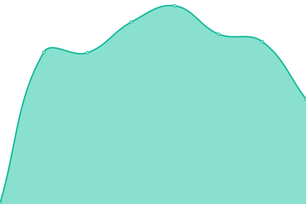
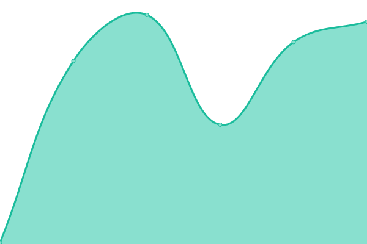

# [📈 Live Status](https://euxzy.github.io/upptime): <!--live status--> **🟧 Partial outage**

This repository contains the open-source uptime monitor and status page for [Muhamad Rijal](https://euxzy.dev), powered by [Upptime](https://github.com/upptime/upptime).

With [Upptime](https://upptime.js.org), you can get your own unlimited and free uptime monitor and status page, powered entirely by a GitHub repository. We use [Issues](https://github.com/euxzy/upptime/issues) as incident reports, [Actions](https://github.com/euxzy/upptime/actions) as uptime monitors, and [Pages](https://euxzy.github.io/upptime) for the status page.

<!--start: status pages-->
<!-- This summary is generated by Upptime (https://github.com/upptime/upptime) -->
<!-- Do not edit this manually, your changes will be overwritten -->
<!-- prettier-ignore -->
| URL | Status | History | Response Time | Uptime |
| --- | ------ | ------- | ------------- | ------ |
|  [Porfolio Website](https://euxzy.dev) | 🟩 Up | [porfolio-website.yml](https://github.com/euxzy/upptime/commits/HEAD/history/porfolio-website.yml) | 

 925ms
     
 | 

<a href="https://status.euxzy.dev/history/porfolio-website">100.00%</a>
    

|  [Wiseline Indonesia](https://wiseline.id) | 🟩 Up | [wiseline-indonesia.yml](https://github.com/euxzy/upptime/commits/HEAD/history/wiseline-indonesia.yml) | 

 991ms
     
 | 

<a href="https://status.euxzy.dev/history/wiseline-indonesia">100.00%</a>
    

|  Wiseline Indonesia (API) | 🟩 Up | [wiseline-indonesia-api.yml](https://github.com/euxzy/upptime/commits/HEAD/history/wiseline-indonesia-api.yml) | 

 907ms
     
 | 

<a href="https://status.euxzy.dev/history/wiseline-indonesia-api">100.00%</a>
    

|  Wiseline Indonesia (API v2) | 🟩 Up | [wiseline-indonesia-api-v2.yml](https://github.com/euxzy/upptime/commits/HEAD/history/wiseline-indonesia-api-v2.yml) | 

 714ms
     
 | 

<a href="https://status.euxzy.dev/history/wiseline-indonesia-api-v2">99.56%</a>
    

|  [Artoshiru](https://artoshiru.euxzy.dev) | 🟥 Down | [artoshiru.yml](https://github.com/euxzy/upptime/commits/HEAD/history/artoshiru.yml) | 

 891ms
     
 | 

<a href="https://status.euxzy.dev/history/artoshiru">0.00%</a>
    

|  [Ceritain](https://ceritain.vercel.app) | 🟥 Down | [ceritain.yml](https://github.com/euxzy/upptime/commits/HEAD/history/ceritain.yml) | 

 3520ms
     
 | 

<a href="https://status.euxzy.dev/history/ceritain">97.64%</a>
    

|  Ceritain (API) | 🟩 Up | [ceritain-api.yml](https://github.com/euxzy/upptime/commits/HEAD/history/ceritain-api.yml) | 

 583ms
     
 | 

<a href="https://status.euxzy.dev/history/ceritain-api">100.00%</a>
    

|  [Custom Hooks](https://hooks.euxzy.com) | 🟥 Down | [custom-hooks.yml](https://github.com/euxzy/upptime/commits/HEAD/history/custom-hooks.yml) | 

 151ms
     
 | 

<a href="https://status.euxzy.dev/history/custom-hooks">97.66%</a>
    

|  [LazyChat](https://lazychat.euxzy.dev) | 🟥 Down | [lazy-chat.yml](https://github.com/euxzy/upptime/commits/HEAD/history/lazy-chat.yml) | 

 885ms
     
 | 

<a href="https://status.euxzy.dev/history/lazy-chat">0.00%</a>
    

<!--end: status pages-->

[**Visit our status website →**](https://euxzy.github.io/upptime)

## 📄 License

- Powered by: [Upptime](https://github.com/upptime/upptime)
- Code: [MIT](./LICENSE) © [Anand Chowdhary](https://anandchowdhary.com), supported by [Pabio](https://pabio.com)
- Data in the `./history` directory: [Open Database License](https://opendatacommons.org/licenses/odbl/1-0/)
